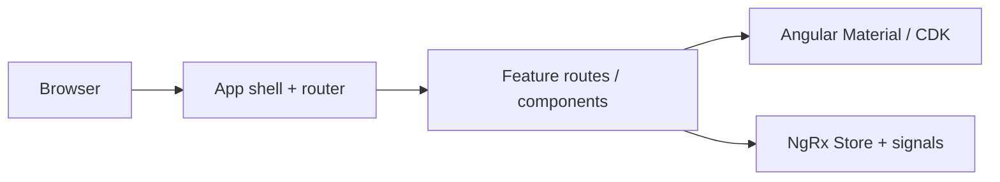

# WebAttendix

WebAttendix is a **web application for attendance management**: recording presence, reviewing attendance history, and supporting the workflows around who was present, when, and in what context (for example classes, teams, or shifts).

The project is built as a modern single-page application (SPA) and is set up for growth into role-based screens, reporting, and integrations with a backend when you add one.

---

## Architecture

WebAttendix follows a **client-side architecture** typical of enterprise Angular apps:

| Layer | Role |
|--------|------|
| **Shell** | Root `App` component with `RouterOutlet` for feature navigation. |
| **Routing** | Angular Router (`app.routes.ts`) for URL-driven views; feature routes can be added and lazy-loaded as the app grows. |
| **UI** | Angular Material and the Component Dev Kit (CDK) for accessible, Material Design 3–aligned components and behaviors. |
| **State** | NgRx Store is registered in `app.config.ts` for predictable global state; `@ngrx/entity` and `@ngrx/signals` are available for normalized collections and signal-based patterns. Local UI state uses Angular **signals**. |
| **Styling** | Component-level **SCSS** plus global theme and tokens in `styles.scss`. |
| **Build & test** | Angular CLI with the application builder (`@angular/build`), **Vitest** for unit tests (`ng test`). |

High-level flow:



There is **no backend in this repository** yet; API integration would typically sit behind Angular services (`providedIn: 'root'`) and optional interceptors for auth and errors.

---

## Tech stack

- **Angular** 21 (standalone components, native control flow, signals)
- **TypeScript** 5.9
- **RxJS** for async streams where needed
- **Angular Material** & **CDK**
- **NgRx** (Store, Entity, Signals)
- **npm** as the package manager (see `package.json`)

---

## Getting started

### Prerequisites

- [Node.js](https://nodejs.org/) (LTS recommended)
- npm (bundled with Node)

### Install dependencies

```bash
npm install
```

### Development server

```bash
npm start
# or: ng serve
```

Open [http://localhost:4200/](http://localhost:4200/). The app reloads when source files change.

### Environment setup

Angular environment files are configured at:

- `src/environments/environment.ts` (development/default)
- `src/environments/environment.production.ts` (production build)

Update `apiBaseUrl` in those files to match your backend endpoints.

- Development (`npm start`) uses `environment.ts`
- Production (`npm run build`) swaps to `environment.production.ts`

### Production build

```bash
npm run build
# or: ng build
```

Artifacts are written under `dist/`.

### Unit tests

```bash
npm test
# or: ng test
```

Tests run with [Vitest](https://vitest.dev/) via the Angular CLI unit-test builder.

---

## Application domains (attendance)

These sections describe the **problem space** WebAttendix is meant to cover. Concrete screens and APIs will evolve as features are implemented.

### Recording attendance

- Check-in / check-out or session-based marking of presence.
- Support for different contexts (e.g. course, event, work shift) once modeled in the app.

### People and organization

- Individuals whose attendance is tracked.
- Optional grouping: classes, departments, teams, or projects.

### Schedules and exceptions

- Expected attendance windows versus ad-hoc sessions.
- Handling absences, late arrivals, and approved leave when rules are defined.

### Reporting and oversight

- Summaries and filters for managers or instructors: who was present on a given day, trends, and exceptions.

### Access control (typical direction)

- Distinct experiences for **participants** (mark or view own attendance) and **organizers** (configure rules, view reports), implemented via routing guards and authenticated APIs when auth is added.

---

## Project layout (high level)

| Path | Purpose |
|------|---------|
| `src/app/` | Application shell, routing, and future feature modules |
| `src/app/app.config.ts` | App-wide providers (router, store, etc.) |
| `src/styles.scss` | Global styles and theme hooks |
| `public/` | Static assets served as-is |
| `angular.json` | CLI workspace and build configuration |

---

## Additional resources

- [Angular documentation](https://angular.dev/)
- [Angular CLI overview](https://angular.dev/tools/cli)
